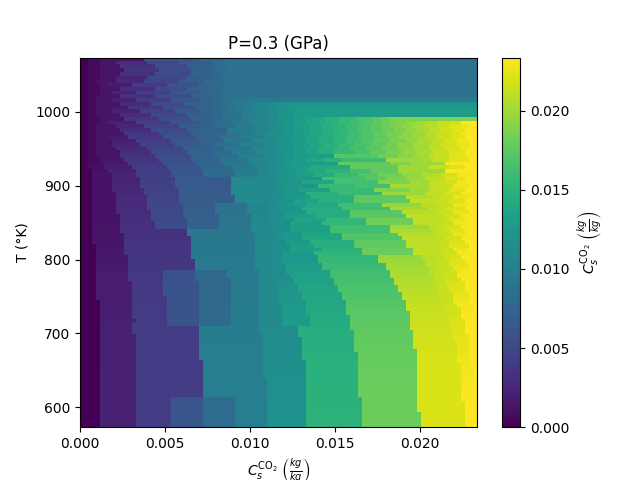
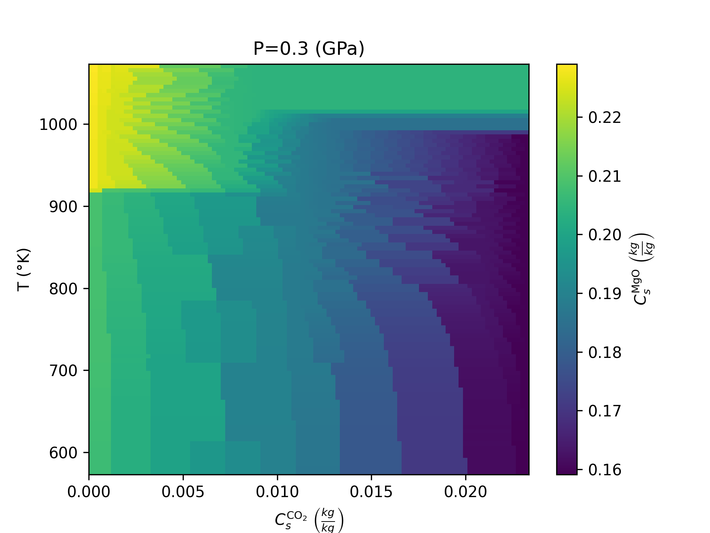
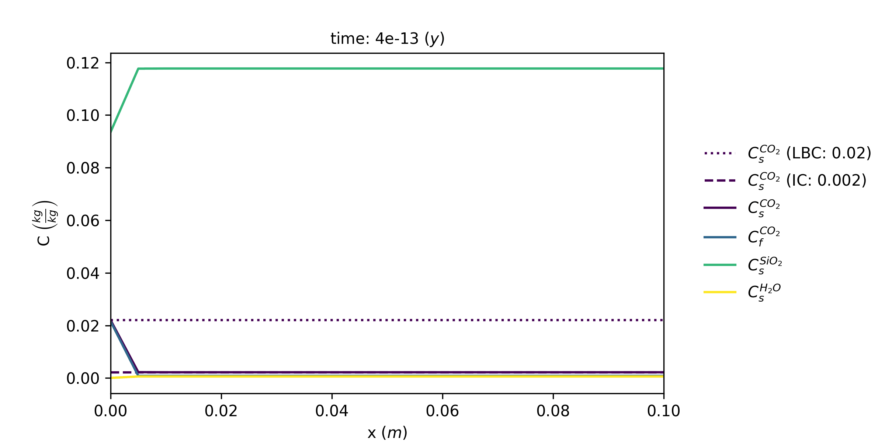
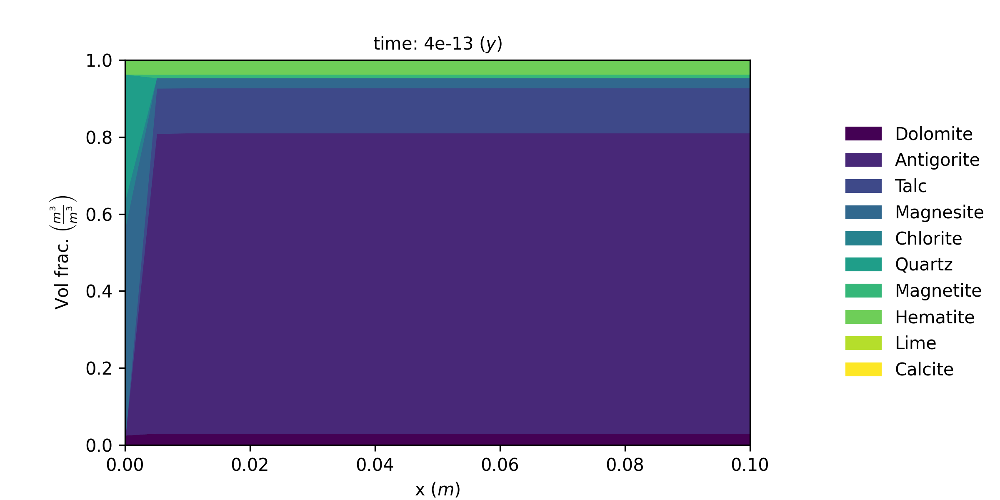

# Alteration of serpentine in the deep crust due to reactive fluid flow

This repository provides a finite difference solver and resources for simulating the reactive fluid flow occuring during the alteration of serpentine in the deep Earth's crust.

## Running the Script

### Environment Setup

```
  python pip install requirements.txt
```

### Plotting the Equilibrium Thermodynamical Data
The equilibrium thermodynamic [data](data) was obtained with the helo of [Thermolab](https://hansjcv.github.io/Thermolab/)

### Running the Simulation
1. The lookup tables are found in [const.py](const.py)
2. The simulation is obtained by running [solver.py](solver.py). The simulation data is saved a .npz file in [output](output). Note that the simulation parameters are found at the beggining of the file

### Plotting the results
Both the equilibrium thermodynamic plots and the animations of the reactive fluid flow are obtained by running [plotting.py](plotting.py). The animations are saved as .png and .gif in [figs](figs)

## Project Description

### Introduction

Fluid-rock interactions provide a link between chemical reactions and mass-energy transport. Understanting these proceses is critical for modeling hydrotermal ore deposit formations, carbon sequestration (carbon capture) and general rheological gravitational and magnetic changes in the litosphere. That being said, the timescales of these processes remain essentially unconstrained. However, analysing the alteration from serpentine to soapstone can expand our understanding, as it provides a good case study due to its clear reaction fronts and abundance of data. This alteration is governed by the $\text{CO}_2$ dissolved in the fluid as such:

```math
\underbrace{2\text{Mg}_3\text{Si}_2\text{O}_5\text{(OH)}_4} _{\text{Serpentine}}
+ 3\text{CO} _{2,aq} 
\to
\underbrace{3\text{MgCO}_3} _{\text{Magnesite}}
+ \underbrace{\text{Mg}_3\text{Si}_4\text{O} _{10}\text{OH}_2} _{\text{Talc}}
+ 3\text{H}_2\text{0}
 \left( + \text{Chlorite} \right)
```

The main serpentine minerals are antigorite, chrysotile and lizardite, which are associated with ultramafic igneous rock formations. The petrological compositional space thus consists of $\text{SiO}_2$, $\text{Al}_2\text{O}_3$, $\text{MgO}$, $\text{FeO}$, $\text{Fe}_2\text{O}_3$  $\text{H}_2\text{O}$, $\text{CO}_2$ and $\text{CaO}$.

<p align="center">
  
  <br>
  <em> a) Serpentine to soapstone alteration front and b) schematic representation of the alteration process (taken from <a href="https://www.nature.com/articles/s41561-020-0554-9">Beinlich et. al. 2020</a>)</em>
</p>

### Physical Background

The 1D alteration of serpentine can be described with the following advection-diffusion-reaction equation

```math
\frac{\partial}{\partial t}\left(\rho_f \phi + \rho_s(1-\phi)\right)
+
\frac{\partial}{\partial x}\left(\rho_f \phi v_f + \rho_s(1-\phi)v_s\right)
= 0
```

where $\rho_s$ and $\rho_f$ are the solids and fluid density respectivley, $\phi$ is the fluid saturation level and $v_s$ and $v_f$ are the solids and fluid velocities respectivley. Furthermore, the mass conservation of the immobile solid species is governed by:

```math
\frac{\partial}{\partial t}\left[\rho_s(1 - C_s^m)(1 - \phi)\right]
+
\frac{\partial}{\partial x}\left[\rho_s(1 - C_s^m)(1 - \phi)v_s\right]
= 0
```

where $C_s^m$ is the weight fraction of the mobile oxides, namely $\text{H}_2\text{O}$, $\text{CO}_2$ and $\text{SiO}_2$. Furthermore, the conservation of total $\text{CO}_2$ is enforced by satisfying:

```math
\frac{\partial}{\partial t}
\left[
\rho_f \phi C_f^{\text{CO}_2}
+
\rho_s (1-\phi) C_s^{\text{CO}_2}
\right]
+
\frac{\partial}{\partial x}
\left[
\rho_f \phi C_f^{\text{CO}_2} v_f
+
\rho_s (1-\phi) C_s^{\text{CO}_2} v_s
\right]
=
\frac{\partial}{\partial x}
\left[
\rho_f \phi D_f^{\text{CO}_2}
\frac{\partial C_f^{\text{CO}_2}}{\partial x}
\right]
```

where $C_f^{\text{CO}_2}$ and $C_s^{\text{CO}_2}$ are the mass fractions of $\text{CO}_2$ in fluids and solids, respectivley and $D_f^{\text{CO}_2}$ is the diffusion coefficient of $\text{CO}_2$ in the fluid. Lastly, the fluid flow can be described with Darcy's law (where the velocity of solids $v_s$ is assumed to be 0):

```math
\phi(v_f - v_s) = - \frac{k\phi^3}{\mu_f}\left(\frac{\partial p_f}{\partial x} + \rho_sg\right)
```

where $k$ is the permeability, $\mu_f$ is the dynamic viscosity of the fluid, $p_f$ is the fluid pressure and $g$ is the gravitational constant. The system of 3 unknowns is governed by 3 equations, making it solvalble, however it is very non-linear. For that reason a simple finite difference scheme was adopted according to [Beinlich et. al. 2020](https://www.nature.com/articles/s41561-020-0554-9)

### Methods

The thermodynamic equlibrium solid solution model was first assumed for 2 seperate Pressure and Temperature (PT) conditions, namely for low PT condiitons (0.3 GPa and 300°C, Beinlich et. al. 2020) and for high PT conditions (2.5 GPa and 800°C, [Ota et. al. 2004](https://www.sciencedirect.com/science/article/abs/pii/S0024493704000027)). The two equilibrium thermodynamic models were then simulated in [Thermolab](https://hansjcv.github.io/Thermolab/) assuming the following oxide weight fractions (Beinlich et. al. 2020):

```math
\text{CaO}: 1.01\% ;
\quad
\text{SiO}_2: 40.08\% ;
\quad
\text{Al}_2\text{O}_3: 2.43\% ;
\quad
\text{MgO}: 34.97\% ;
\quad
\text{FeO}: 4.22\% ;
\quad
\text{Fe}_2\text{O}_3: 8.25\% ;
\quad
\text{H}_2\text{O}: 9.68\%
```

The solid phases used in the model were Dolomite, Antigorite, Talc, Magnesite, Chlorite, Brucite, Orthopyroxene, Olivine, Quartz, Periclase, Corundum, Andalusite, Magnetite, Hematite, Lime and Calcite. The fluid phase used in the model was $\text{H}_2\text{O} - \text{CO}_2$. The obtained equilibrium thermodynamic variables were then stored and used as a lookup table in the main diffusion-advection-reaction equation simulation. As an example, the thermodynamic equilibrium results for the weight fractions $C_s^{\text{CO}_2}$ and $C_s^{\text{MgO}}$ in low PT conditions are displayed in the plots below:

<p align="center">
  
  
</p>


The simulation domain of $L=1m$ was partitioned into 100 cells. At $t=0$ porosity $\phi$ was assumed constant across all cells, while the fluid pressure $p_f$ was assumed as a uniform gradient from $x=0$ to $x=1$ going from 0.3 GPa to 0.0 GPa for low PT conditions and 2.5 GPa to 0.0 GPa for low PT conditions. The use of the lookup table in the simulation in a single time step was used as such:

1. From the lookup table fetch $C_s^{\text{CO}_2}$
2. From the lookup table fetch $\rho_s$, $\rho_f$, $\mu_f$ and $C_s^{\text{MgO}_2}$. The latter represents the mass fraction of immobile solid species
3. Get the values of $\rho_s$, $\rho_f$, $\mu_f$ and $C_s^{\text{MgO}_2}$ by preforming linear interpolation in respect to $C_s^{\text{CO}_2}$
4. Preform calculations with the obtained values of $\rho_s$, $\rho_f$, $\mu_f$ and $C_s^{\text{MgO}_2}$
5. Update $C_s^{\text{CO}_2}$ and $\mu_f$

As an example, the values  obtained by the [solver](solver.py) of the weight fractions $C_s^{\text{CO}_2}$, $C_f^{\text{CO}_2}$, $C_s^{\text{SiO}_2}$, $C_s^{\text{H}_2\text{O}}$ and the volumetric proportions of different minerals in low PT conditions are displayed in the animations below:

<p align="center">
  
  
</p>

### Discussion and Limitaitons

Thermobaric conditions appear to influence the type of alteration more strongly than the overall rate of alteration. The model predicts a reaction front propagation of approximately 100 cm per year, which is higher than the ~13 cm per year estimated by Beinlich et al. (2020), but still comparable to the rate of tectonic plate motion. This suggests that such alteration processes may occur on timescales relevant to geological processes in newly formed oceanic lithosphere. Consequently, carbon storage in serpentine could represent a feasible option from the perspective of time efficiency.

The comparison between the two thermobaric conditions is based solely on thermodynamic equilibrium rather than the kinetic model. At high pressure–temperature conditions, antigorite is not predicted to form, meaning that serpentine alteration is not represented. Additionally, the model assumes zero solid velocity, unrealistic porosity values, and a prescribed pressure gradient to satisfy numeric stability. Finally, the predicted $\text{CO}_2$ concentrations in the solid phase do not match the levels measured in some natural soapstones.

### References

Beinlich, A., John, T., Vrijmoed, J. C., Tominaga, M., Magna, T., & Podladchikov, Y. Y. (2020). Instantaneous rock transformations in the deep crust driven by reactive fluid flow. Nature Geoscience, 13, 307–312. https://doi.org/10.1038/s41561-020-0554-9

Vrijmoed, J. C., & Podladchikov, Y. Y. (2022). Thermolab: A thermodynamics laboratory for nonlinear transport processes in open systems. Geochemistry, Geophysics, Geosystems, 23, e2021GC010303. https://doi.org/10.1029/2021GC010303

Ota, Tsutomu, Masaru Terabayashi, and Ikuo Katayama. 2004. "Thermobaric Structure and Metamorphic Evolution of the Iratsu Eclogite Body in the Sanbagawa Belt, Central Shikoku, Japan." Journal of Metamorphic Geology 22, no. 3 (2004): 95–126. https://www.sciencedirect.com/science/article/pii/S0024493704000027
